# Dicequest (REV 500pts)

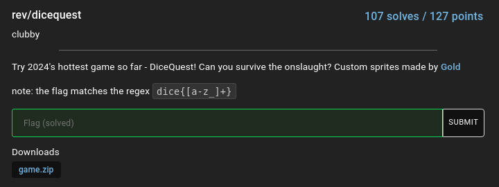

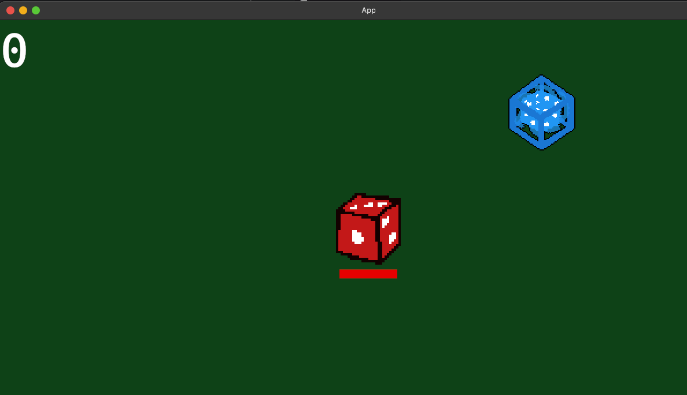

First time to do reverse engineering a game since with only experience of patching unity games with lucky patcher :D through mobile phone. I thought I cannot solve this challenge since the binary file is too big 30 mega bytes in size and stripped. In before I also encountered a challenge like this but I was not able to solve due to lack of experience in  binary analysis. This time I tried my best.

## Stepping on the game before reversing

This game is very simple and easy to play.

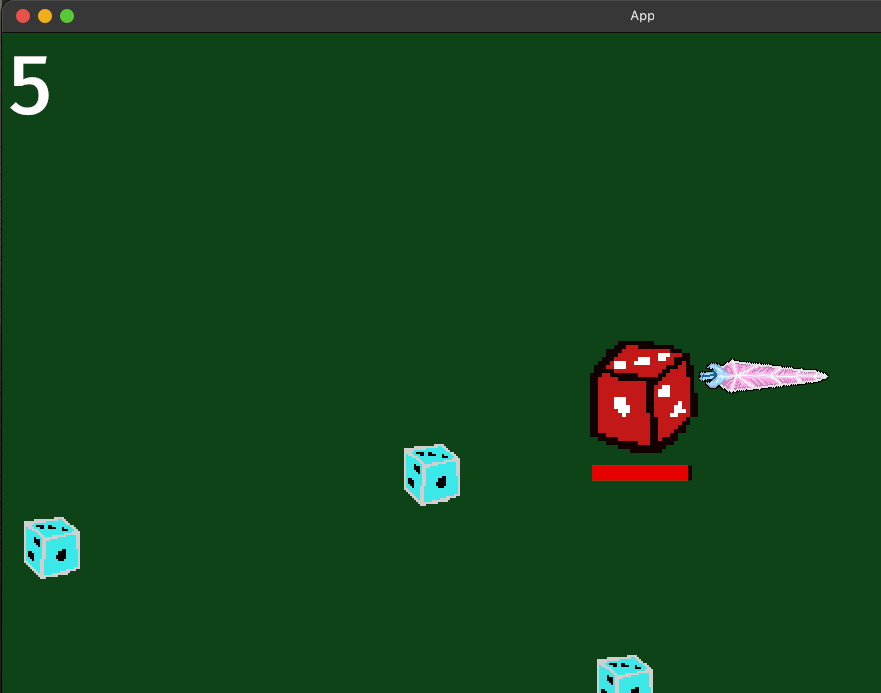

Once you attack the small monsters our dice will earn 5 coins and reduces the health from smaller to bigger when attacking many times instantly. 

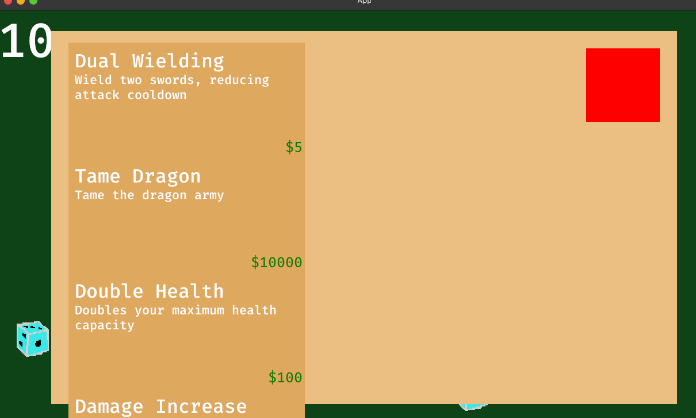

While earning coins we can buy some items in the shop to build up stats of our dice. And then I noticed the shop sells `Tame Dragon` so there will be dragons in the game and might give the flag once we survived. Attempting to buy it will show `can't afford` message in the console.

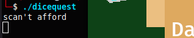

I played the game for a while to see if there is a dragon monster.

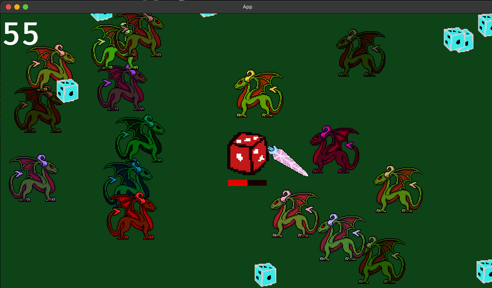

Damn, there were a lot of dragons and my dice died. Checking the console if there is something info that might help me to solve the challenge. And I only got 

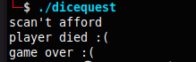

I ran the game again and again to see if there is something more but unfortunately NOTHING.

## Reversing the game

After playing the game we need to list down the goals for reversing.

List of my goals when reversing a game:
- Find the flag (Always if viewable).
- Patch the instruction bytes of the game functions.
- Patch the instruction bytes where was the money being updated.

So my first step before decompiling this is to use `strings` command to see if there is a flag in the binary or we can find some useful information. I copy the output to a file for me to able use tools for searching like VSCODE.

After searching around in the output file I found rustc code then thinking this game was written in rustc and bevy_ecs. I don't have any knowledge about rustc and bevy_ecs so I need to search for it. For this I will not tackle more about bevyengine, if you want to know more about it you can visit this [link](https://bevyengine.org/).

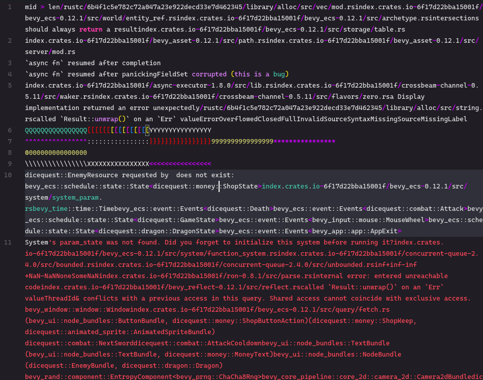

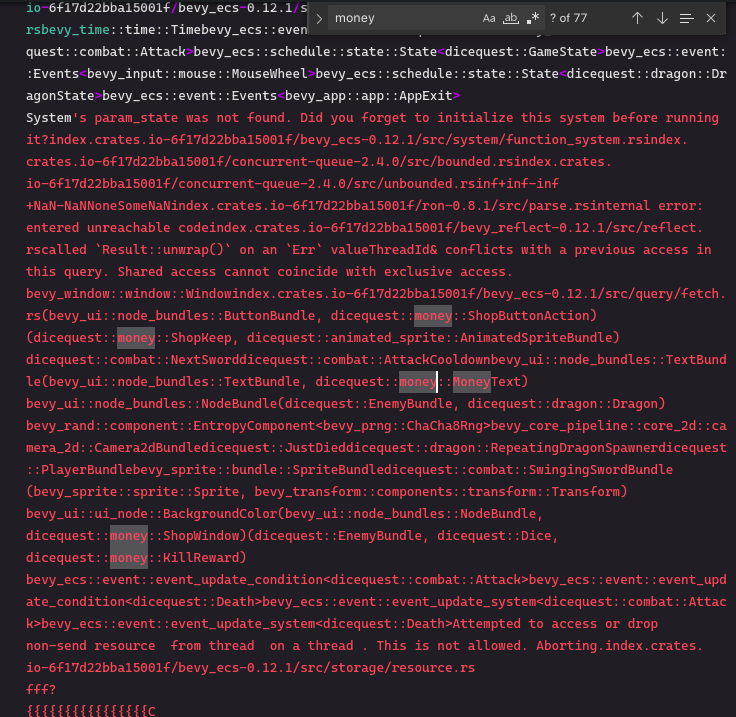

These strings are interesting to me because these are the native rustc strings behind the game. And I found some interesting code that might be useful to crack.

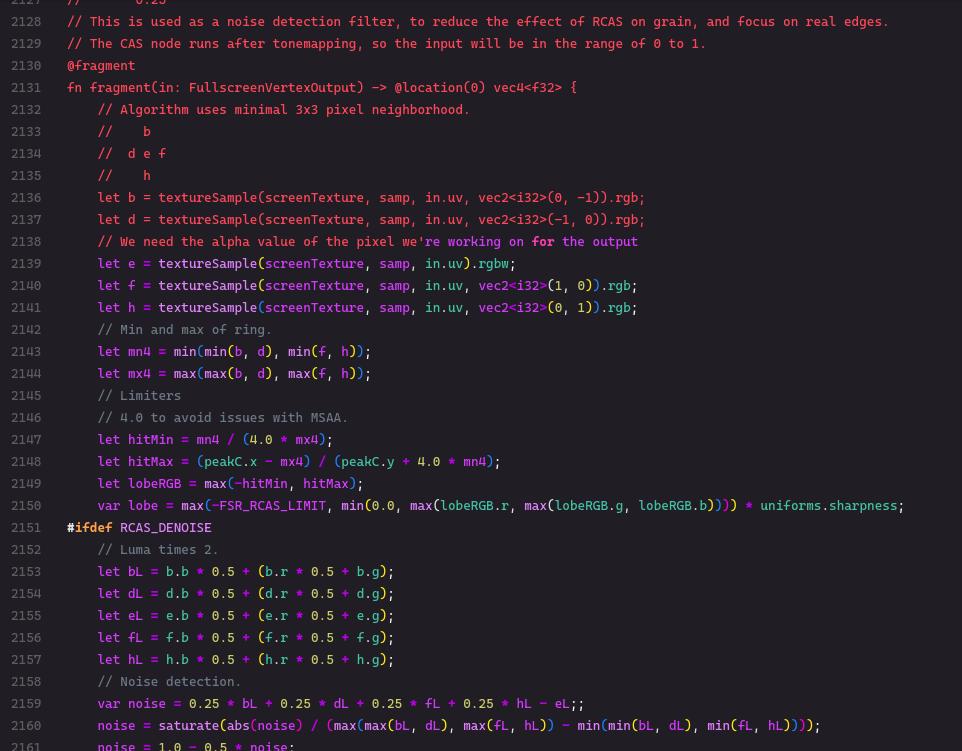

Unfortunately these are useless!!. Instead of reading the strings I need to start decompiling and find where `can't afford` was located and being called. Because to think patching the instruction bytes of money will need to analyze the code flow.

At first I used IDA to decompile the binary file of the game but it took so long to finish all the analysis and hard to navigate. So I decided to use Ghidra even though it consumes more time on analysis part but it's worth it.

What was I like about Ghidra is easy to find the references and cross references of the functions and variables. Although IDA has also these features, and best decompiler but I'm not comfortable using it for this time only.

Here it is.

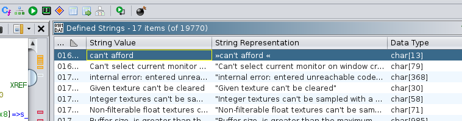

Then I changed the variables and functions names to make it more readable and easy to understand.

Moving forward, `can't afford` was called after the money balance checks on buying the item in the shop (obviously). 

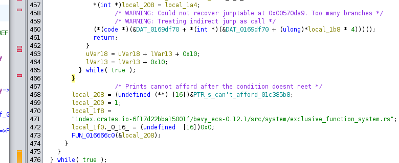

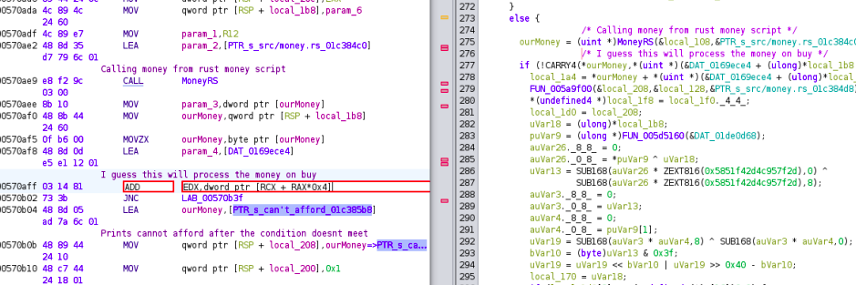

I began to patch this instruction, because I found out that this was the money balance was being updated after buying the first item in the shop.

So from `SUB` to `ADD` but not yet since this will only increment by 5 on buy `Dual Weilding`. 

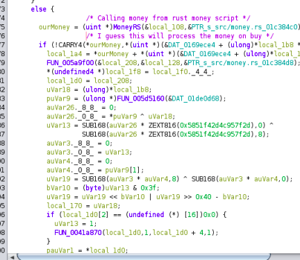

I need more like one shot...

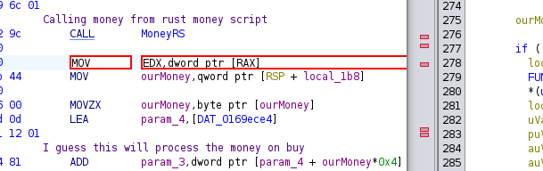

The copied value of this instruction is from the item price. So I patched this instruction with our custom constant value `0x33235` or we can do 99999 but I am not greedy.

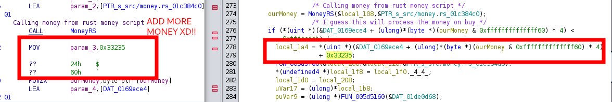

After that, saved the patched bytes to a new binary file and ran the game. 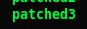

I played again with the patch and buy all the items in the shop or only `Tame Dragon`. The dragons forms like a flag.

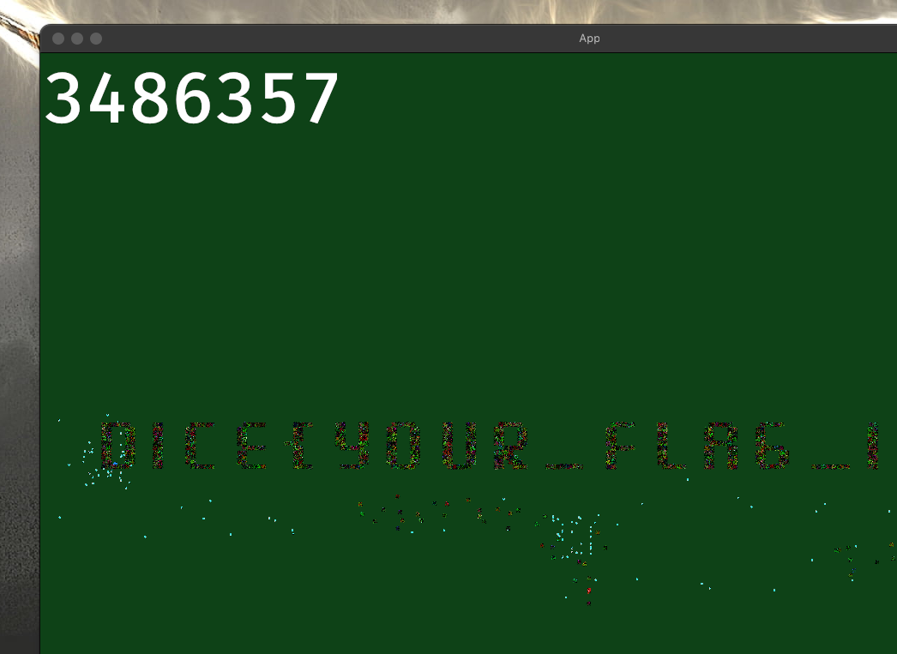

Flag: dice{your_flag_is_not_in_another_castle}