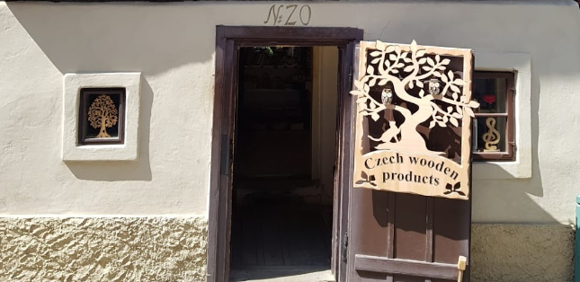
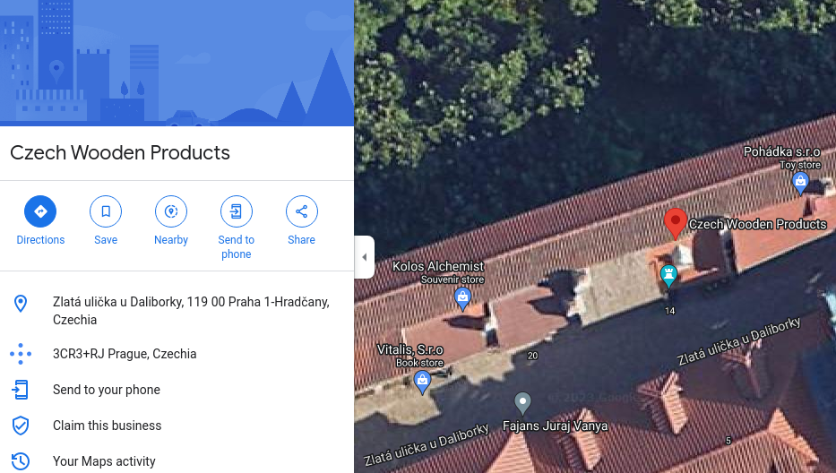

# Czech Where? (OSINT)

Iris visited this cool shop a while back, but forgot where it was! What street is it on?

FYI: flag is all lowercase and _ for spaces. Please remove all accent marks if there are any. Wrap your answer in irisctf{}.

Given image:

To search where is this image taken from we can use the text written in the door, because maybe this is a shop.

Searching "Czech wooden products" in google maps we can have the street.

`Street: Zlatá ulička u Daliborky, 119 00 Praha 1-Hradčany, Czechia`

Flag: irisctf{zlata_ulicka_u_daliborky}
