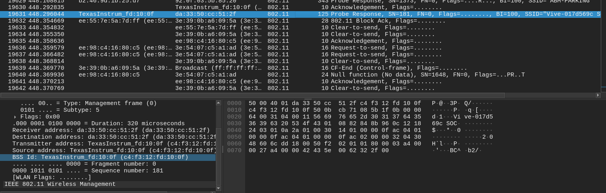

# Where is skat (Network/OSINT)

While traveling over the holidays, I was doing some casual wardriving (as I often do). Can you use my capture to find where I went?

Note: the flag is irisctf{the_location}, where the_location is the full name of my destination location, not the street address. For example, irisctf{Washington_Monument}. Note that the flag is not case sensitive.

This challenge is just to analyze the pcap and find where skat went to.
In order to understand this challenge, wardriving is the act of searching for Wi-Fi wireless networks by a person in a moving vehicle, using a laptop or smartphone. Software for wardriving is freely available on the Internet. Warbiking, warcycling, warwalking and similar use of other modes of transportation are also referred to by this term. It is an example of the old saying "the journey is the reward".

So, we can just find the last wifi BSSID from where skat was connected to and search it on wiggle.

Last BSSID: c4:f3:12:fd:10:0f

Location: Los Angeles Union Station

Flag: irisctf{Los_Angeles_Union_Station}